# UML Activity Diagram — Agenda eGov

## Overview

Activity diagram untuk flow utama di aplikasi Agenda eGov:
- Authentication Flow (Login/Register)
- Subscribe Notifikasi Flow
- CRUD Agenda Flow (Admin)
- Kirim Notifikasi Flow (Scheduler)

---

## 1. Authentication Flow (Login)

### Mermaid Diagram

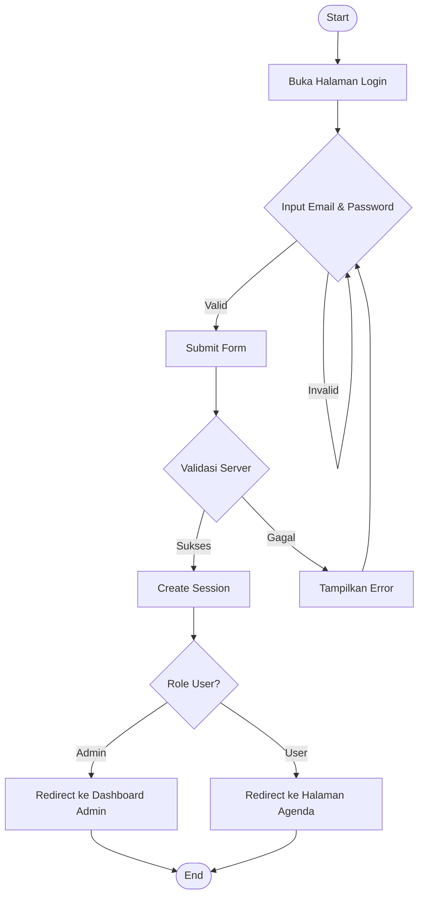

### PlantUML Diagram

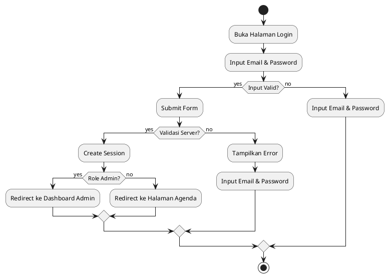

---

## 2. Register Flow

### Mermaid Diagram

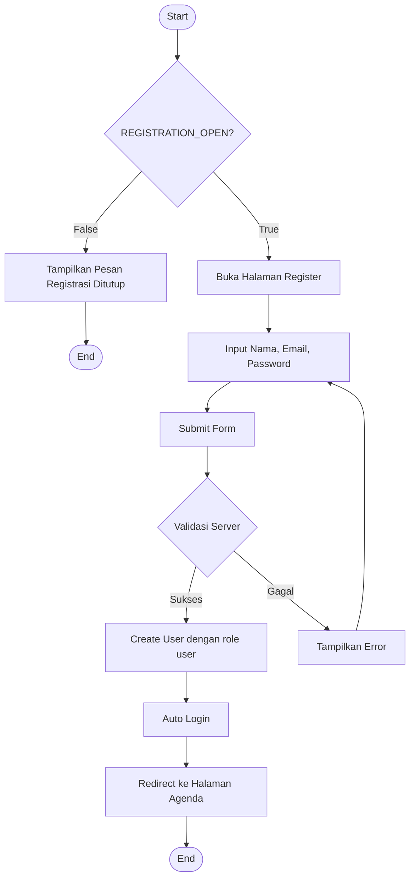

### PlantUML Diagram

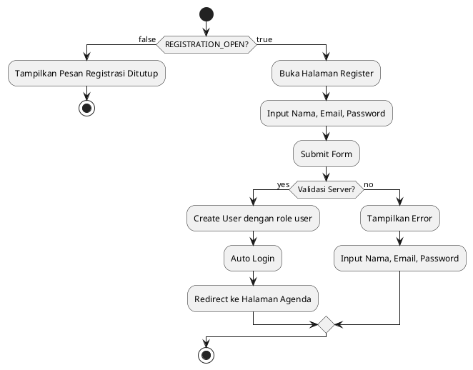

---

## 3. Subscribe Notifikasi Flow

### Mermaid Diagram

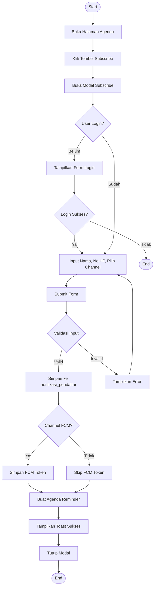

### PlantUML Diagram

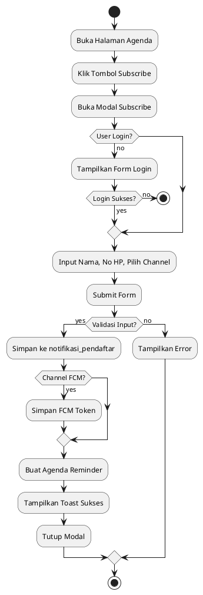

---

## 4. CRUD Agenda Flow (Admin) - Create

### Mermaid Diagram

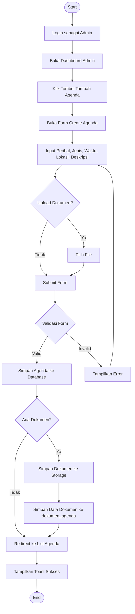

### PlantUML Diagram

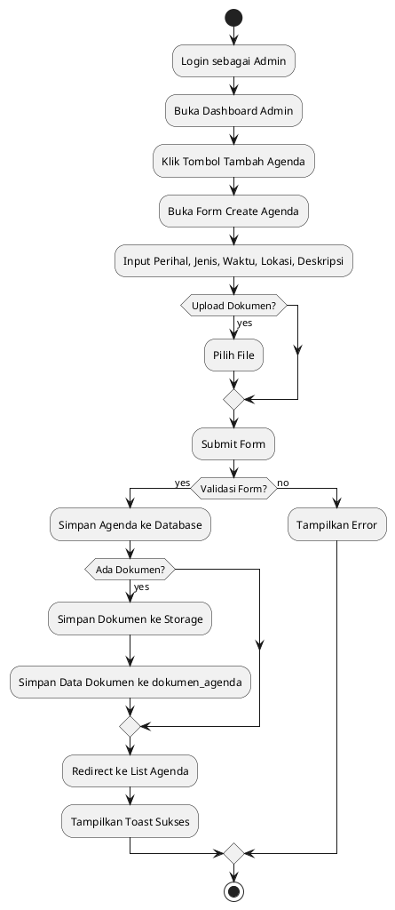

---

## 5. CRUD Agenda Flow (Admin) - Update

### Mermaid Diagram

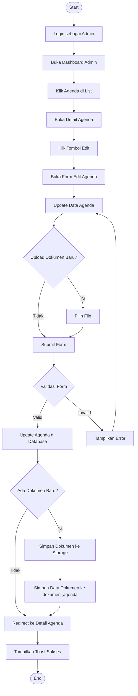

### PlantUML Diagram

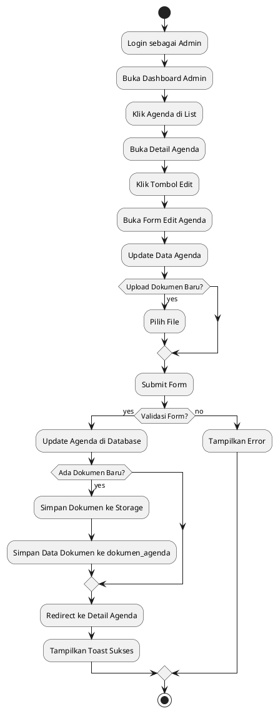

---

## 6. Kirim Notifikasi Flow (Scheduler)

### Mermaid Diagram

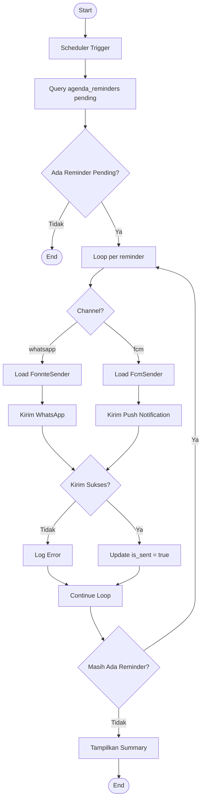

### PlantUML Diagram

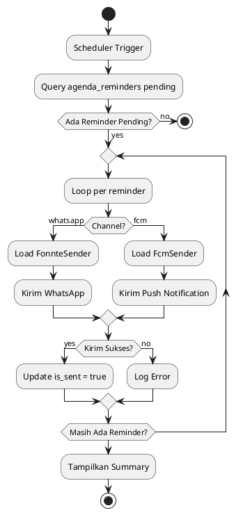

---

## 7. Download Dokumen Flow

### Mermaid Diagram

```mermaid
flowchart TD
    A([Start]) --> B[Buka Detail Agenda]
    B --> C[Klik Tombol Download Dokumen]
    C --> D[Fetch document via /documents/{id}]
    D --> E{Dokumen Ada?}
    E -->|Tidak| F[Tampilkan 404]
    F --> G([End])
    E -->|Ya| H[DocumentController serve file]
    H --> I[Convert to Blob]
    I --> J[Create temporary <a> tag]
    J --> K[Trigger download]
    K --> L[Remove <a> tag]
    L --> M([End])
```

### PlantUML Diagram

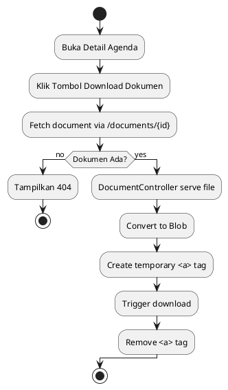

---

## 8. Test Notifikasi Flow (Admin)

### Mermaid Diagram

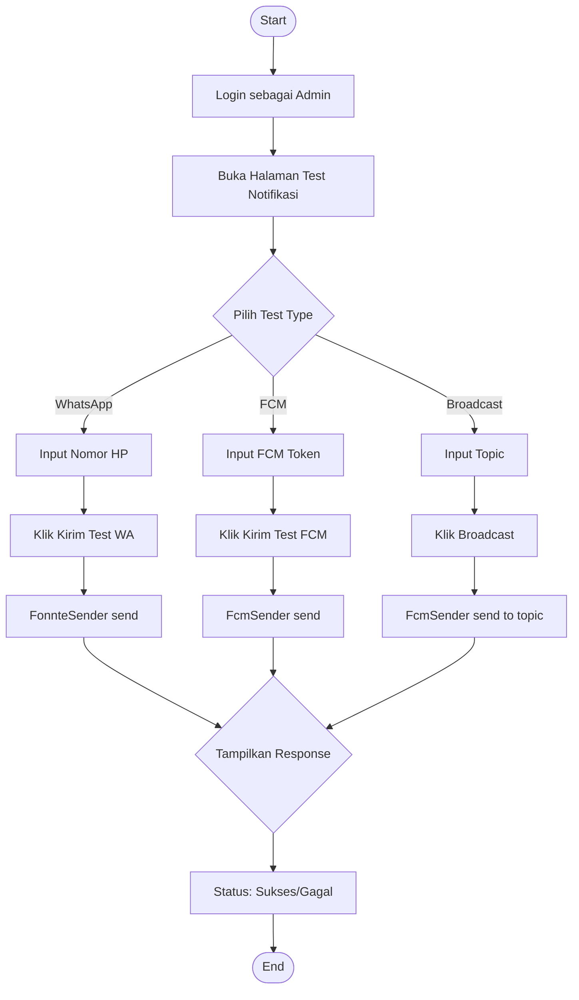

### PlantUML Diagram

```plantuml
@startuml
start
:Login sebagai Admin;
divide "Pilih Test Type"
    if (WhatsApp?) then (yes)
        :Input Nomor HP;
        :Klik Kirim Test WA;
        :FonnteSender send;
    elseif (FCM?) then (yes)
        :Input FCM Token;
        :Klik Kirim Test FCM;
        :FcmSender send;
    elseif (Broadcast?) then (yes)
        :Input Topic;
        :Klik Broadcast;
        :FcmSender send to topic;
    endif
end division
:Tampilkan Response;
:Status: Sukses/Gagal;
stop
@enduml
```

---

## Notes

- **Authentication Flow**: Menggunakan Laravel Breeze untuk UI dan session management
- **Subscribe Notifikasi**: Data disimpan ke `notifikasi_pendaftar`, `fcm_tokens`, dan `agenda_reminders`
- **CRUD Agenda**: Dokumen disimpan di `storage/app/public` dan diakses via route `/documents/{id}`
- **Kirim Notifikasi**: Dijalankan oleh scheduler setiap 5 menit via `php artisan agenda:send-reminders`
- **Download Dokumen**: Menggunakan blob URL untuk menghindari intercept oleh IDM
- **Test Notifikasi**: Panel admin untuk testing Fonnte dan FCM secara manual
