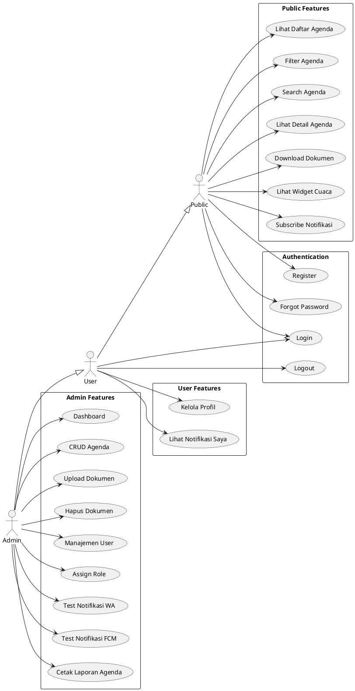

# UML Use Case Diagram — Agenda eGov

## Overview

Use case diagram untuk aplikasi Agenda eGov dengan tiga aktor utama:
- **Public** — Pengunjung tanpa autentikasi
- **User** — Pengguna terautentikasi (role: user)
- **Admin** — Pengguna terautentikasi (role: admin)

---

## Mermaid Diagram

```mermaid
useCaseDiagram
    actor "Public" as Public
    actor "User" as User
    actor "Admin" as Admin

    package "Public Features" {
        usecase "Lihat Daftar Agenda" as UC1
        usecase "Filter Agenda" as UC2
        usecase "Search Agenda" as UC3
        usecase "Lihat Detail Agenda" as UC4
        usecase "Download Dokumen" as UC5
        usecase "Lihat Widget Cuaca" as UC6
        usecase "Subscribe Notifikasi" as UC7
    }

    package "Authentication" {
        usecase "Login" as UC8
        usecase "Register" as UC9
        usecase "Logout" as UC10
        usecase "Forgot Password" as UC11
    }

    package "User Features" {
        usecase "Kelola Profil" as UC12
        usecase "Lihat Notifikasi Saya" as UC13
    }

    package "Admin Features" {
        usecase "Dashboard" as UC14
        usecase "CRUD Agenda" as UC15
        usecase "Upload Dokumen" as UC16
        usecase "Hapus Dokumen" as UC17
        usecase "Manajemen User" as UC18
        usecase "Assign Role" as UC19
        usecase "Test Notifikasi WA" as UC20
        usecase "Test Notifikasi FCM" as UC21
        usecase "Cetak Laporan Agenda" as UC22
    }

    Public --> UC1
    Public --> UC2
    Public --> UC3
    Public --> UC4
    Public --> UC5
    Public --> UC6
    Public --> UC7

    Public --> UC8
    Public --> UC9
    Public --> UC11

    User --> UC8
    User --> UC10
    User --> UC12
    User --> UC13
    User --|> Public

    Admin --> UC14
    Admin --> UC15
    Admin --> UC16
    Admin --> UC17
    Admin --> UC18
    Admin --> UC19
    Admin --> UC20
    Admin --> UC21
    Admin --> UC22
    Admin --|> User
```

---

## PlantUML Diagram



---

## Use Case Descriptions

### Public Features

| Use Case | Deskripsi | Precondition | Postcondition |
|----------|-----------|--------------|---------------|
| **Lihat Daftar Agenda** | Melihat daftar semua agenda publik | - | Daftar agenda ditampilkan dengan status badge |
| **Filter Agenda** | Filter agenda berdasarkan status (terjadwal/selesai/dibatalkan) | - | Daftar agenda terfilter ditampilkan |
| **Search Agenda** | Pencarian agenda dengan debounce | - | Hasil pencarian ditampilkan real-time |
| **Lihat Detail Agenda** | Melihat detail lengkap satu agenda | Agenda ada | Detail agenda ditampilkan dengan dokumen |
| **Download Dokumen** | Download dokumen agenda via blob URL | Dokumen ada | File ter-download tanpa IDM intercept |
| **Lihat Widget Cuaca** | Melihat cuaca real-time dari Open-Meteo | - | Widget cuaca ditampilkan (suhu, kondisi, kelembapan, angin) |
| **Subscribe Notifikasi** | Daftar untuk notifikasi agenda (WA/FCM/Both) | - | Data tersimpan di `notifikasi_pendaftar` |

### Authentication

| Use Case | Deskripsi | Precondition | Postcondition |
|----------|-----------|--------------|---------------|
| **Login** | Masuk ke sistem dengan email/password | Akun terdaftar | Session terautentikasi |
| **Register** | Mendaftar akun baru (jika `REGISTRATION_OPEN=true`) | - | Akun baru dibuat dengan role `user` |
| **Logout** | Keluar dari sistem | Terautentikasi | Session dihapus |
| **Forgot Password** | Request reset password | Akun terdaftar | Email reset dikirim |

### User Features

| Use Case | Deskripsi | Precondition | Postcondition |
|----------|-----------|--------------|---------------|
| **Kelola Profil** | Update profil pribadi | Terautentikasi | Profil diperbarui |
| **Lihat Notifikasi Saya** | Melihat riwayat notifikasi yang diterima | Terautentikasi | Daftar notifikasi ditampilkan |

### Admin Features

| Use Case | Deskripsi | Precondition | Postcondition |
|----------|-----------|--------------|---------------|
| **Dashboard** | Melihat statistik agenda dan filter | Role admin | Dashboard ditampilkan |
| **CRUD Agenda** | Create, Read, Update, Delete agenda | Role admin | Data agenda diperbarui |
| **Upload Dokumen** | Upload dokumen ke agenda (PDF/gambar/Office) | Role admin | Dokumen tersimpan di `dokumen_agenda` |
| **Hapus Dokumen** | Hapus dokumen dari agenda | Role admin | Dokumen dihapus dari storage dan DB |
| **Manajemen User** | Kelola akun pengguna | Role admin | Data user diperbarui |
| **Assign Role** | Mengubah role user (admin/user) | Role admin | Role user diperbarui |
| **Test Notifikasi WA** | Test kirim WhatsApp via Fonnte | Role admin | Notifikasi WA terkirim |
| **Test Notifikasi FCM** | Test kirim push notification | Role admin | Push notification terkirim |
| **Cetak Laporan Agenda** | Generate laporan agenda | Role admin | Laporan siap cetak |

---

## Actor Hierarchy

```
Admin
  └─ extends ── User
                  └─ extends ── Public
```

- **Admin** memiliki semua akses User + fitur admin
- **User** memiliki semua akses Public + fitur user terautentikasi
- **Public** adalah aktor dasar dengan akses fitur publik

---

## Relationships

### Include
- **CRUD Agenda** includes **Upload Dokumen**
- **CRUD Agenda** includes **Hapus Dokumen**

### Extend
- **Subscribe Notifikasi** <<extend>> **Lihat Detail Agenda**

### Generalization
- **User** generalizes **Public**
- **Admin** generalizes **User**

---

## Notes

- Semua use case Public dapat diakses tanpa login
- Fitur User memerlukan autentikasi
- Fitur Admin memerlukan role `admin` (middleware: `role:admin`)
- Notifikasi dikirim via scheduler: `php artisan agenda:send-reminders`
- Dokumen diakses via route `/documents/{id}` bukan langsung dari storage
