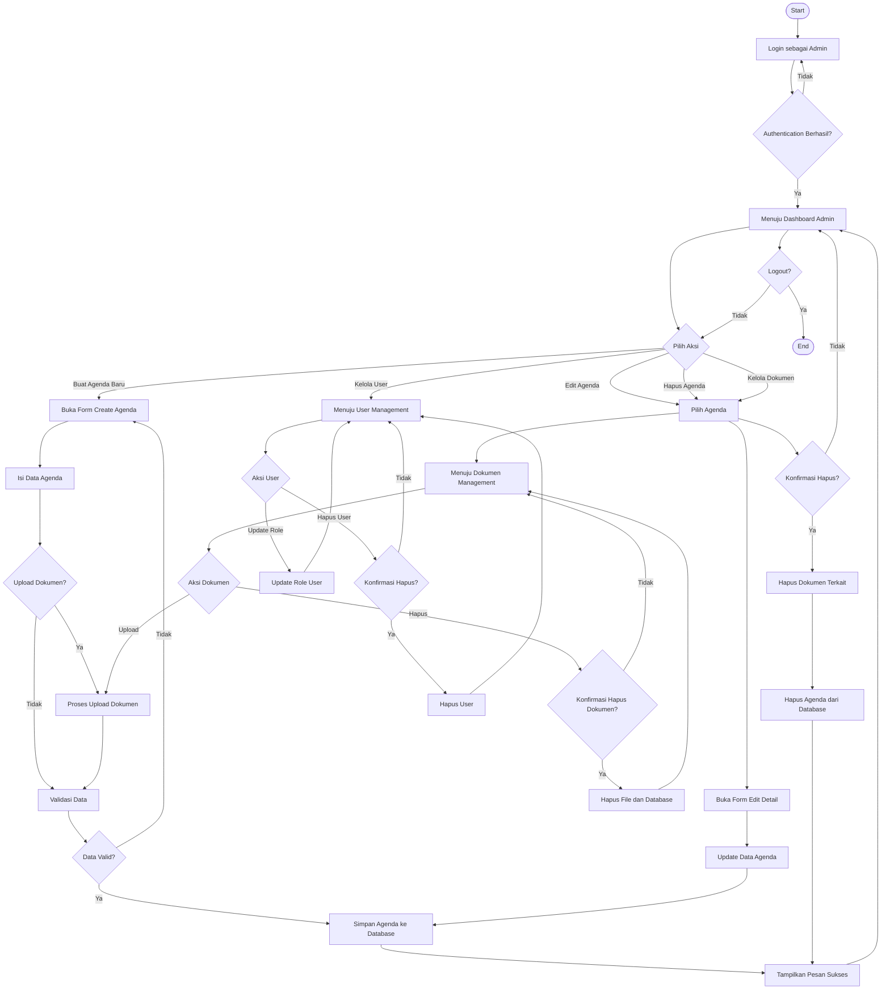

# Activity Diagram - Manajemen Agenda oleh Admin

## Deskripsi
Diagram ini menunjukkan alur lengkap manajemen agenda oleh administrator sistem, mulai dari login, CRUD agenda, manajemen dokumen, hingga manajemen user.

## Diagram

## Penjelasan Alur

### 1. Login
- Admin memasukkan kredensial login
- Sistem melakukan validasi
- Jika berhasil, diarahkan ke dashboard admin
- Jika gagal, kembali ke halaman login

### 2. Dashboard
- Admin memilih aksi yang ingin dilakukan:
  - Buat Agenda Baru
  - Edit Agenda
  - Hapus Agenda
  - Kelola Dokumen
  - Kelola User

### 3. Buat Agenda Baru
- Buka form create agenda
- Isi data agenda (perihal, waktu, tempat, dll)
- Opsional: upload dokumen
- Validasi data
- Simpan ke database
- Tampilkan pesan sukses

### 4. Edit/Hapus Agenda
- Pilih agenda dari daftar
- Buka form edit/confirm delete
- Update data atau konfirmasi hapus
- Jika hapus: hapus dokumen terkait dulu
- Simpan perubahan ke database

### 5. Kelola Dokumen
- Pilih agenda
- Masuk ke manajemen dokumen
- Upload dokumen baru atau hapus dokumen
- Dokumen disimpan ke storage dan database

### 6. Kelola User
- Masuk ke user management
- Update role user (admin/user)
- Hapus user (dengan validasi minimal 1 admin)
- Simpan perubahan

### 7. Logout
- Admin memilih logout
- Session dihapus
- Diarahkan ke halaman login
