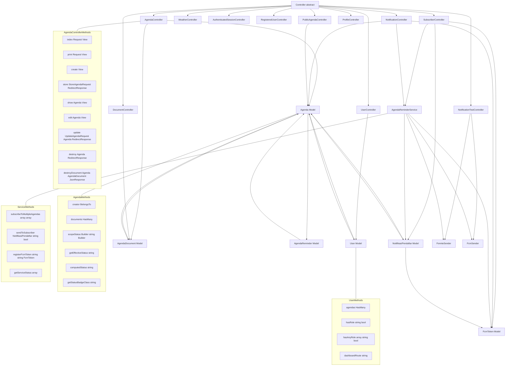

# Class Diagram - Agenda eGov

## Deskripsi
Diagram ini menunjukkan struktur class dan hubungan antar komponen dalam aplikasi Agenda eGov, termasuk Controllers, Models, dan Services.

## Diagram

## Struktur Class

### Controllers

#### Controller (Abstract)
Base class untuk semua controllers di Laravel.

#### AgendaController
Controller untuk manajemen agenda oleh admin.

**Methods:**
- `index(Request $request): View` - Tampilkan daftar agenda dengan filter
- `print(Request $request): View` - Tampilkan view print agenda
- `create(): View` - Tampilkan form create agenda
- `store(StoreAgendaRequest $request): RedirectResponse` - Simpan agenda baru
- `show(Agenda $agenda): View` - Tampilkan detail agenda
- `edit(Agenda $agenda): View` - Tampilkan form edit agenda
- `update(UpdateAgendaRequest $request, Agenda $agenda): RedirectResponse` - Update agenda
- `destroy(Agenda $agenda): RedirectResponse` - Hapus agenda
- `destroyDocument(Agenda $agenda, AgendaDocument $document): JsonResponse|RedirectResponse` - Hapus dokumen

#### UserController
Controller untuk manajemen user oleh admin.

**Methods:**
- `index(): View` - Tampilkan daftar user
- `updateRole(Request $request, User $user): RedirectResponse` - Update role user
- `destroy(Request $request, User $user): RedirectResponse` - Hapus user

#### NotificationTestController
Controller untuk testing notifikasi (WhatsApp & FCM).

**Methods:**
- `index(): View` - Tampilkan panel test
- `testWhatsapp(Request $request): JsonResponse` - Test kirim WhatsApp
- `testFcm(Request $request): JsonResponse` - Test kirim FCM
- `testFcmBroadcast(Request $request): JsonResponse` - Test broadcast FCM
- `debugReminders(): JsonResponse` - Debug status reminder
- `runScheduler(): JsonResponse` - Jalankan scheduler manual

#### SubscriberController
Controller untuk manajemen subscriber notifikasi.

**Methods:**
- `index(Request $request): View` - Tampilkan daftar subscriber
- `resend(NotifikasiPendaftar $subscriber): JsonResponse` - Resend notifikasi
- `destroy(NotifikasiPendaftar $subscriber): JsonResponse` - Hapus subscriber
- `destroyFcmToken(FcmToken $fcmToken): JsonResponse` - Hapus FCM token
- `bulkResend(Request $request): JsonResponse` - Bulk resend notifikasi

#### WeatherController
Controller untuk API weather (proxy ke OpenWeatherMap/Open-Meteo).

**Methods:**
- `__invoke(Request $request)` - Handle weather API request

#### AuthenticatedSessionController
Controller untuk autentikasi login/logout.

**Methods:**
- `create(): View` - Tampilkan form login
- `store(LoginRequest $request): RedirectResponse` - Proses login
- `destroy(Request $request): RedirectResponse` - Proses logout

#### RegisteredUserController
Controller untuk registrasi user baru.

**Methods:**
- `create(): View|RedirectResponse` - Tampilkan form register
- `store(Request $request): RedirectResponse` - Proses register

#### DocumentController
Controller untuk serve/download dokumen.

**Methods:**
- `show(AgendaDocument $document): Response|StreamedResponse` - Tampilkan dokumen
- `download(AgendaDocument $document): Response|StreamedResponse` - Download dokumen

#### NotificationController
Controller untuk subscribe notifikasi publik.

**Methods:**
- `search(Request $request): JsonResponse` - Search agenda untuk modal
- `subscribe(Request $request): JsonResponse` - Subscribe ke agenda
- `registerFcmToken(Request $request): JsonResponse` - Register FCM token
- `status(): JsonResponse` - Get status service notifikasi

#### ProfileController
Controller untuk manajemen profil user.

**Methods:**
- `edit(Request $request): View` - Tampilkan form edit profil
- `update(ProfileUpdateRequest $request): RedirectResponse` - Update profil
- `destroy(Request $request): RedirectResponse` - Hapus akun

#### PublicAgendaController
Controller untuk halaman publik agenda.

**Methods:**
- `index(Request $request): View` - Tampilkan daftar agenda publik
- `show(Agenda $agenda): View` - Tampilkan detail agenda publik

### Models

#### Agenda
Model untuk tabel agenda.

**Relationships:**
- `creator(): BelongsTo` - User yang membuat agenda
- `documents(): HasMany` - Dokumen agenda

**Methods:**
- `scopeStatus(Builder $query, string $status): Builder` - Scope filter status
- `getEffectiveStatusAttribute(): string` - Accessor status efektif (termasuk berlangsung)
- `computedStatus(): string` - Hitung status berdasarkan waktu
- `getStatusBadgeClassAttribute(): string` - Get CSS class untuk badge status

#### AgendaDocument
Model untuk tabel dokumen_agenda.

**Relationships:**
- `agenda(): BelongsTo` - Agenda terkait

**Accessors:**
- `url: string` - URL dokumen
- `download_url: string` - URL download dokumen
- `exists: bool` - Cek file ada
- `extension: string` - Ekstensi file
- `type: string` - Tipe file

#### AgendaReminder
Model untuk tabel agenda_reminders (legacy).

**Relationships:**
- `agenda(): BelongsTo` - Agenda terkait

**Methods:**
- `markAsSent(): void` - Mark sebagai terkirim
- `scopePending($query)` - Filter yang belum terkirim
- `scopeForChannel($query, string $channel)` - Filter berdasarkan channel

#### FcmToken
Model untuk tabel fcm_tokens.

**Methods:**
- `scopeActive($query)` - Filter token aktif
- `subscribeToAgenda(int $agendaId): void` - Subscribe ke agenda
- `unsubscribeFromAgenda(int $agendaId): void` - Unsubscribe dari agenda
- `isSubscribedTo(int $agendaId): bool` - Cek subscribe
- `findByToken(string $token): self` - Cari berdasarkan token
- `hasReminderSent(int $agendaId): bool` - Cek reminder sudah dikirim
- `markReminderSent(int $agendaId): void` - Mark reminder terkirim

#### NotifikasiPendaftar
Model untuk tabel notifikasi_pendaftar.

**Relationships:**
- `agenda(): BelongsTo` - Agenda terkait
- `fcmToken(): BelongsTo` - FCM token terkait

**Accessors:**
- `reminder_label: string` - Label waktu reminder
- `reminder_time: Carbon` - Waktu reminder

**Methods:**
- `scopePending($query)` - Filter yang belum terkirim
- `scopeNeedWhatsapp($query)` - Filter butuh kirim WA
- `scopeNeedFcm($query)` - Filter butuh kirim FCM
- `markWhatsappSent(): void` - Mark WA terkirim
- `markFcmSent(): void` - Mark FCM terkirim
- `isComplete(): bool` - Cek semua channel terkirim

#### User
Model untuk tabel users.

**Relationships:**
- `agendas(): HasMany` - Agenda yang dibuat user

**Methods:**
- `hasRole(string $role): bool` - Cek role
- `hasAnyRole(array|string $roles): bool` - Cek salah satu role
- `dashboardRoute(): string` - Get route dashboard berdasarkan role

### Services

#### AgendaReminderService
Service untuk orchestrator multi-channel notifikasi.

**Methods:**
- `subscribeToMultipleAgendas(array $data): array` - Subscribe ke banyak agenda
- `sendToSubscriber(NotifikasiPendaftar $subscriber, string $type): bool` - Kirim ke subscriber
- `registerFcmToken(string $token, string $deviceName): FcmToken` - Register FCM token
- `getServiceStatus(): array` - Get status services (Fonnte/FCM)

#### FonnteSender
Service untuk kirim notifikasi WhatsApp via Fonnte API.

**Methods:**
- `send(string $phone, string $message): array` - Kirim pesan WA
- `isConfigured(): bool` - Cek konfigurasi

#### FcmSender
Service untuk kirim notifikasi push via Firebase Cloud Messaging.

**Methods:**
- `sendToToken(string $token, string $title, string $body, array $data = []): array` - Kirim ke token
- `sendToTopic(string $topic, string $title, string $body): array` - Kirim ke topic
- `isConfigured(): bool` - Cek konfigurasi

## Hubungan Antar Class

### Inheritance
- Semua controllers inherit dari `Controller` (abstract)

### Dependency Injection
- **AgendaController** menggunakan `Agenda` dan `AgendaDocument`
- **UserController** menggunakan `User`
- **NotificationTestController** menggunakan `FonnteSender` dan `FcmSender`
- **SubscriberController** menggunakan `AgendaReminderService`, `NotifikasiPendaftar`, `FcmToken`
- **DocumentController** menggunakan `AgendaDocument`
- **NotificationController** menggunakan `AgendaReminderService`, `Agenda`, `FcmToken`
- **PublicAgendaController** menggunakan `Agenda`

### Service Composition
- **AgendaReminderService** menggunakan `FonnteSender` dan `FcmSender`
- **AgendaReminderService** membuat `NotifikasiPendaftar` dan `FcmToken`

### Model Relationships
- **Agenda** has many `AgendaDocument`, `AgendaReminder`, `NotifikasiPendaftar`
- **Agenda** belongs to `User`
- **AgendaDocument** belongs to `Agenda`
- **AgendaReminder** belongs to `Agenda`
- **NotifikasiPendaftar** belongs to `Agenda` dan `FcmToken`
- **User** has many `Agenda`
