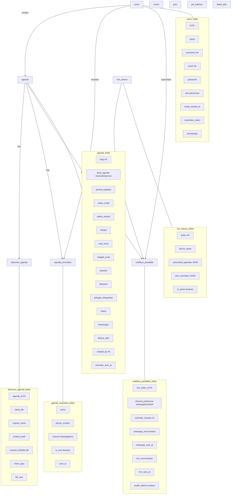

# ERD (Entity Relationship Diagram) - Agenda eGov

## Deskripsi
Diagram ini menunjukkan struktur database lengkap untuk aplikasi Agenda eGov, termasuk relasi antar tabel dan kolom-kolom yang ada.

## Diagram

## Tabel Database

### users
Tabel untuk menyimpan data user/pengguna sistem.

| Kolom | Tipe | Deskripsi |
|-------|------|----------|
| id | bigint | Primary Key |
| name | string | Nama lengkap user |
| username | string | Username (unique) |
| email | string | Email (unique) |
| password | string | Password terenkripsi |
| role | string | Role (admin/user) |
| email_verified_at | timestamp | Waktu verifikasi email |
| remember_token | string | Token remember me |
| created_at | timestamp | Waktu dibuat |
| updated_at | timestamp | Waktu diupdate |

### agenda
Tabel utama untuk menyimpan data agenda kegiatan.

| Kolom | Tipe | Deskripsi |
|-------|------|----------|
| id | bigint | Primary Key |
| slug | string | Slug URL (unique) |
| jenis_agenda | enum | Internal/Eksternal |
| perihal_kegiatan | string | Perihal kegiatan |
| waktu_mulai | datetime | Waktu mulai agenda |
| waktu_selesai | datetime | Waktu selesai agenda |
| tempat | string | Tempat pelaksanaan |
| asal_surat | string | Asal surat |
| tanggal_surat | date | Tanggal surat |
| pakaian | string | Kode pakaian |
| disposisi | string | Disposisi |
| petugas_ditugaskan | string | Petugas ditugaskan |
| status | enum | terjadwal/selesai/dibatalkan |
| keterangan | text | Keterangan tambahan |
| diinput_oleh | string | Nama yang menginput |
| created_by | bigint | ID user yang membuat (FK) |
| reminder_sent_at | datetime | Waktu reminder dikirim |
| created_at | timestamp | Waktu dibuat |
| updated_at | timestamp | Waktu diupdate |

### dokumen_agenda
Tabel untuk menyimpan dokumen/attachment agenda.

| Kolom | Tipe | Deskripsi |
|-------|------|----------|
| id | bigint | Primary Key |
| agenda_id | bigint | ID agenda (FK) |
| nama_file | string | Nama file di storage |
| original_name | string | Nama asli file |
| content_hash | string | Hash SHA-256 konten |
| content | longblob | Konten file (opsional) |
| mime_type | string | MIME type file |
| file_size | bigint | Ukuran file dalam bytes |
| created_at | timestamp | Waktu dibuat |
| updated_at | timestamp | Waktu diupdate |

### agenda_reminders
Tabel untuk antrian pengingat agenda (legacy).

| Kolom | Tipe | Deskripsi |
|-------|------|----------|
| id | bigint | Primary Key |
| nama | string | Nama penerima |
| phone_number | string | Nomor telepon |
| channel | enum | whatsapp/fcm |
| is_sent | boolean | Status terkirim |
| sent_at | datetime | Waktu terkirim |
| agenda_id | bigint | ID agenda (FK) |
| created_at | timestamp | Waktu dibuat |
| updated_at | timestamp | Waktu diupdate |

### fcm_tokens
Tabel untuk menyimpan FCM device tokens untuk notifikasi browser.

| Kolom | Tipe | Deskripsi |
|-------|------|----------|
| id | bigint | Primary Key |
| token | string | FCM token (unique) |
| device_name | string | Nama device |
| subscribed_agendas | json | Daftar ID agenda yang disubscribe |
| sent_reminders | json | Daftar reminder yang sudah dikirim |
| is_active | boolean | Status aktif |
| created_at | timestamp | Waktu dibuat |
| updated_at | timestamp | Waktu diupdate |

### notifikasi_pendaftar
Tabel untuk menyimpan data subscriber notifikasi publik.

| Kolom | Tipe | Deskripsi |
|-------|------|----------|
| id | bigint | Primary Key |
| agenda_id | bigint | ID agenda (FK) |
| nama | string | Nama subscriber |
| phone_number | string | Nomor WhatsApp |
| fcm_token_id | bigint | ID FCM token (FK) |
| channel_preference | enum | whatsapp/fcm/both |
| reminder_minutes | int | Menit sebelum agenda (default: 60) |
| status | string | Status |
| whatsapp_sent | boolean | Status WA terkirim |
| whatsapp_sent_at | datetime | Waktu WA terkirim |
| fcm_sent | boolean | Status FCM terkirim |
| fcm_sent_at | datetime | Waktu FCM terkirim |
| sudah_dikirim | boolean | Flag sudah dikirim |
| created_at | timestamp | Waktu dibuat |
| updated_at | timestamp | Waktu diupdate |

### cache, jobs, job_batches, failed_jobs
Tabel sistem Laravel untuk caching dan queue processing.

## Relasi Antar Tabel

1. **users → agenda**: One-to-Many (satu user bisa membuat banyak agenda)
2. **users → agenda_reminders**: One-to-Many (satu user bisa menerima banyak reminder)
3. **users → notifikasi_pendaftar**: One-to-Many (satu user bisa subscribe banyak agenda)
4. **agenda → dokumen_agenda**: One-to-Many (satu agenda bisa punya banyak dokumen)
5. **agenda → agenda_reminders**: One-to-Many (satu agenda punya banyak reminder)
6. **agenda → notifikasi_pendaftar**: One-to-Many (satu agenda punya banyak subscriber)
7. **fcm_tokens → notifikasi_pendaftar**: One-to-Many (satu token bisa dipakai banyak subscriber)
