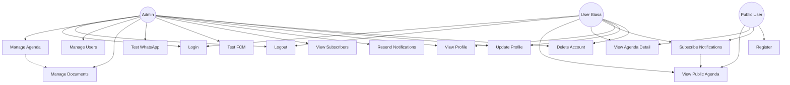

# Use Case Diagram - Agenda eGov

## Aktor
- **Admin**: Administrator sistem
- **User Biasa**: Pengguna terdaftar dengan role user
- **Public User**: Pengguna publik yang belum login

## Use Case

## Deskripsi Use Case

### Admin
1. **Login**: Masuk ke sistem dengan kredensial admin
2. **Logout**: Keluar dari sistem
3. **Manage Agenda**: CRUD agenda (Create, Read, Update, Delete)
4. **Manage Users**: Kelola user (update role, delete user)
5. **Manage Documents**: Upload dan hapus dokumen agenda
6. **Test WhatsApp**: Test kirim notifikasi WhatsApp
7. **Test FCM**: Test kirim notifikasi push browser
8. **View Subscribers**: Lihat daftar subscriber notifikasi
9. **Resend Notifications**: Kirim ulang notifikasi gagal
10. **View Profile**: Lihat profil sendiri
11. **Update Profile**: Update data profil
12. **Delete Account**: Hapus akun sendiri

### User Biasa
1. **Login**: Masuk ke sistem
2. **Logout**: Keluar dari sistem
3. **View Public Agenda**: Lihat daftar agenda publik
4. **View Agenda Detail**: Lihat detail agenda
5. **Subscribe Notifications**: Berlangganan notifikasi agenda
6. **View Profile**: Lihat profil sendiri
7. **Update Profile**: Update data profil
8. **Delete Account**: Hapus akun sendiri

### Public User
1. **View Public Agenda**: Lihat daftar agenda publik
2. **View Agenda Detail**: Lihat detail agenda
3. **Subscribe Notifications**: Berlangganan notifikasi agenda
4. **Register**: Daftar akun baru (jika registration dibuka)

## Hubungan Use Case
- **Manage Agenda** includes **Manage Documents**: Saat mengelola agenda, admin juga mengelola dokumen
- **Subscribe Notifications** includes **View Public Agenda**: User harus melihat agenda sebelum subscribe
